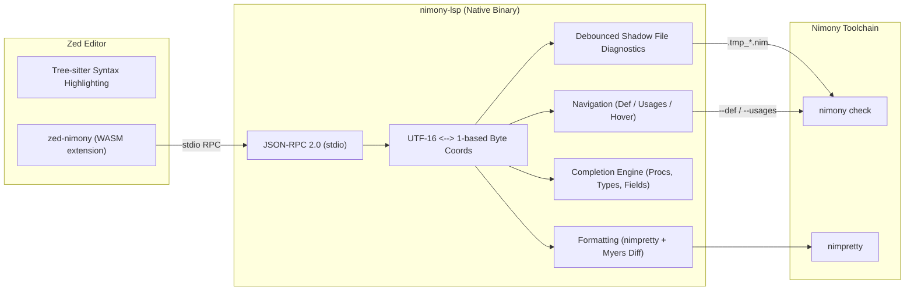

# Nimony LSP & Zed Extension

[](https://github.com/0xd3174/nimony-lsp/actions/workflows/ci.yml)
[](tests/e2e/run_tests.sh)
[](crates/nimony-lsp)
[](crates/zed-nimony)
[](flake.nix)

High-performance Language Server Protocol (LSP 3.17) server for the [Nimony](https://github.com/nim-lang/nimony) compiler, paired with an official [Zed](https://zed.dev) editor extension.

---

## Architecture Overview



---

## Features

- **Live Debounced Diagnostics:** 300ms debounce loop compiling temporary shadow files (`.tmp_*.nim`) and instant checks on save. Parses compiler errors, warnings, and maps instantiation traces to LSP `relatedInformation`.
- **Code Navigation:**
  - **Go to Definition:** Jumps to procs, parameters, variables, types, and external imported modules (`nimony check --def:file,line,col`).
  - **Find References:** Locates all symbol references across the workspace (`nimony check --usages:file,line,col`).
  - **Document Highlights:** Highlights all occurrences of an active identifier (reads vs. writes).
  - **Hover:** Displays symbol definitions, inferred types, signatures, and doc comments.
- **Smart Completion:**
  - Nim language keywords and built-in primitive types.
  - Common code snippets (`proc`, `iterator`, `type object`).
  - Buffer declarations: in-scope procs, variables, generic types (`Box[T]`), and indented object fields.
- **Document Formatting:** Full-document formatting via `nimpretty`, translated into minimal text edits using the Myers diff algorithm.
- **Encoding Safety:** Bidirectional mapping between LSP 0-based UTF-16 code units and Nimony's 1-based byte positions. Fully tested against surrogate pairs, multi-byte UTF-8, and astral emojis (🚀).
- **Zed Extension:**
  - Registers the `Nimony` language for `.nim`, `.nims`, and `.nimble` files.
  - Complete Tree-sitter syntax highlighting (`highlights.scm`), auto-bracket pairing (`brackets.scm`), and indentation rules (`indents.scm`).
  - Native WASM binary (`wasm32-wasip2`) that manages `nimony-lsp` lifecycle.

---

## Repository Structure

```
nimony-lsp/
├── flake.nix                     # Declarative Nix environment (nimony 0.6.3, nim 2.2, rust)
├── Makefile                      # Build automation targets
├── Cargo.toml                    # Root workspace configuration
├── crates/
│   ├── nimony-lsp/               # Native Rust LSP server
│   │   └── src/
│   │       ├── main.rs           # Entry point & stdio initialization
│   │       ├── server.rs         # JSON-RPC loop & document sync
│   │       ├── coords.rs         # UTF-16 <-> 1-based byte position mapping
│   │       ├── diagnostics.rs    # Shadow files, debounce loop & diagnostic parser
│   │       ├── navigation.rs     # Definition, usages, hover & document highlights
│   │       ├── completion.rs     # In-buffer AST regex & snippet completion
│   │       └── formatting.rs     # nimpretty runner & Myers diff
│   └── zed-nimony/               # Zed editor WASM extension
│       ├── extension.toml        # Zed extension manifest
│       ├── languages/nimony/     # Grammar configuration & Tree-sitter queries
│       └── src/lib.rs            # Extension API implementation
└── tests/
    └── e2e/                      # Comprehensive 5-Tier E2E test suite
```

---

## Installation

### Prerequisites
- **Nimony Compiler:** `nimony` must be accessible in your `PATH` (or specified via the `NIMONY_BIN` environment variable) to provide diagnostics, Go to Definition, and Find References.
- **Code Formatter (Optional):** `nimpretty` (included with Nim 2.0+) must be in your `PATH` (or specified via `NIMPRETTY_BIN`) to enable document formatting.

Precompiled binaries and extension bundles are provided under [Releases](https://github.com/0xd3174/nimony-lsp/releases).

### 1. Download Executables
Download the `nimony-lsp` binary for your platform:
- **Linux:** `nimony-lsp-linux-x86_64`
- **macOS:** `nimony-lsp-macos-arm64` (Apple Silicon) or `nimony-lsp-macos-x86_64` (Intel)
- **Windows:** `nimony-lsp-windows-x86_64.exe`

Make the binary executable on Unix systems (`chmod +x nimony-lsp-*`) and place it in your `PATH` (e.g., `~/.local/bin/nimony-lsp`).

---

### 2. Install the Zed Extension
Download and extract `nimony-extension.tar.gz` (or `nimony-extension.zip` on Windows):

- **Via Zed Command Palette:** Open the Command Palette (`Ctrl+Shift+P` on Linux/Windows, `Cmd+Shift+P` on macOS), select `zed: install dev extension`, and choose the extracted `nimony` directory.
- **Manual Placement:** Alternatively, place the extracted `nimony` directory directly into:
  - **Linux:** `~/.local/share/zed/extensions/installed/nimony`
  - **macOS:** `~/Library/Application Support/Zed/extensions/installed/nimony`
  - **Windows:** `%LOCALAPPDATA%\Zed\extensions\installed\nimony`

---

### 3. Editor Configuration

Add the following configuration to your Zed `settings.json` (`Ctrl+,` or `Cmd+,`):

```json
{
  "languages": {
    "Nimony": {
      "language_servers": ["nimony-lsp"],
      "format_on_save": "on"
    }
  },
  "lsp": {
    "nimony-lsp": {
      "binary": {
        // If nimony-lsp is available in PATH:
        "path": "nimony-lsp"
        // Alternatively, provide the absolute path to the binary:
        // "path": "/path/to/nimony-lsp"
      }
    }
  }
}
```

---

## Building from Source

For detailed instructions on compiling from source, configuring the Nix development environment, running the E2E test suite, and debugging, see [BUILDING.md](BUILDING.md).

---

## Test Verification

The project includes an authoritative 5-tier automated test suite covering all LSP capabilities and edge cases:

| Tier | Focus Area | Tests | Status |
| :--- | :--- | :---: | :---: |
| **Tier 1** | Core LSP capabilities (Diagnostics, Navigation, Completion, Formatting, WASM build) | 53 | **PASS** |
| **Tier 2** | Boundary cases (Empty files, UTF-8 astral characters/emojis, malformed JSON-RPC, cancellation) | 25 | **PASS** |
| **Tier 3** | Interactive lifecycle (didChange dirty edits $\to$ definition/completion queries, format $\to$ verify) | 8 | **PASS** |
| **Tier 4** | Multi-file cross-module definitions, generic modules (`Box[T]`), and AST refactoring | 7 | **PASS** |
| **Tier 5** | Stdio cleanliness and thread-leak free process shutdown | 1 | **PASS** |
| **Total** | **Comprehensive E2E Coverage** | **94** | **100% PASS** |

Run tests anytime with:
```bash
nix develop -c make test-e2e
```

---

## License

MIT
