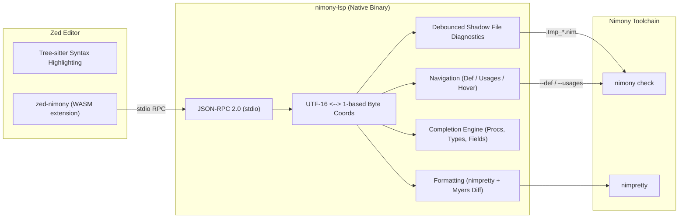

# Nimony LSP & Zed Extension

[](https://github.com/nim-lang/nimony-lsp/actions/workflows/ci.yml)
[](tests/e2e/run_tests.sh)
[](crates/nimony-lsp)
[](crates/zed-nimony)
[](flake.nix)

High-performance Language Server Protocol (LSP 3.17) server for the [Nimony](https://github.com/nim-lang/nimony) compiler, paired with an official [Zed](https://zed.dev) editor extension.

---

## Architecture Overview



---

## Features

- **Live Debounced Diagnostics:** 300ms debounce loop compiling temporary shadow files (`.tmp_*.nim`) and instant checks on save. Parses compiler errors, warnings, and maps instantiation traces to LSP `relatedInformation`.
- **Code Navigation:**
  - **Go to Definition:** Jumps to procs, parameters, variables, types, and external imported modules (`nimony check --def:file,line,col`).
  - **Find References:** Locates all symbol references across the workspace (`nimony check --usages:file,line,col`).
  - **Document Highlights:** Highlights all occurrences of an active identifier (reads vs. writes).
  - **Hover:** Displays symbol definitions, inferred types, signatures, and doc comments.
- **Smart Completion:**
  - Nim language keywords and built-in primitive types.
  - Common code snippets (`proc`, `iterator`, `type object`).
  - Buffer declarations: in-scope procs, variables, generic types (`Box[T]`), and indented object fields.
- **Document Formatting:** Full-document formatting via `nimpretty`, translated into minimal text edits using the Myers diff algorithm.
- **Encoding Safety:** Bidirectional mapping between LSP 0-based UTF-16 code units and Nimony's 1-based byte positions. Fully tested against surrogate pairs, multi-byte UTF-8, and astral emojis (🚀).
- **Zed Extension:**
  - Registers the `Nimony` language for `.nim`, `.nims`, and `.nimble` files.
  - Complete Tree-sitter syntax highlighting (`highlights.scm`), auto-bracket pairing (`brackets.scm`), and indentation rules (`indents.scm`).
  - Native WASM binary (`wasm32-wasip2`) that manages `nimony-lsp` lifecycle.

---

## Repository Structure

```
nimony-lsp/
├── flake.nix                     # Declarative Nix environment (nimony 0.6.3, nim 2.2, rust)
├── Makefile                      # Build automation targets
├── Cargo.toml                    # Root workspace configuration
├── crates/
│   ├── nimony-lsp/               # Native Rust LSP server
│   │   └── src/
│   │       ├── main.rs           # Entry point & stdio initialization
│   │       ├── server.rs         # JSON-RPC loop & document sync
│   │       ├── coords.rs         # UTF-16 <-> 1-based byte position mapping
│   │       ├── diagnostics.rs    # Shadow files, debounce loop & diagnostic parser
│   │       ├── navigation.rs     # Definition, usages, hover & document highlights
│   │       ├── completion.rs     # In-buffer AST regex & snippet completion
│   │       └── formatting.rs     # nimpretty runner & Myers diff
│   └── zed-nimony/               # Zed editor WASM extension
│       ├── extension.toml        # Zed extension manifest
│       ├── languages/nimony/     # Grammar configuration & Tree-sitter queries
│       └── src/lib.rs            # Extension API implementation
└── tests/
    └── e2e/                      # Comprehensive 5-Tier E2E test suite
```

---

## Installation & Setup Guide

### 0. Precompiled Binaries & Zed Extension Bundle (No Rust Required)

If you don't want to compile from source, pre-built native binaries and Zed WASM bundles are published automatically by GitHub Actions for every release:

1. **Download `nimony-lsp`:**
   - Grab the binary for your platform (`Linux x86_64`, `macOS arm64/x86_64`, `Windows x86_64`) from [GitHub Releases](https://github.com/nim-lang/nimony-lsp/releases).
   - Place it into your `PATH` (e.g. `~/.local/bin/nimony-lsp` or `C:\Program Files\nimony-lsp\nimony-lsp.exe`).
2. **Download Zed Extension Bundle:**
   - Grab `nimony-extension.tar.gz` (or `.zip` for Windows).
   - Extract it.
   - In Zed, press `Ctrl+Shift+P` (or `Cmd+Shift+P`) and choose `zed: install dev extension`, then select the extracted `nimony` directory.
   - *Alternative:* Simply move the extracted `nimony` folder into:
     - Linux: `~/.local/share/zed/extensions/installed/nimony`
     - macOS: `~/Library/Application Support/Zed/extensions/installed/nimony`
     - Windows: `%LOCALAPPDATA%\Zed\extensions\installed\nimony`

---

### 1. Nix / NixOS (Declarative)

On NixOS or systems using the Nix package manager, all dependencies (compiler, Rust toolchain with WebAssembly targets, and dependencies) are declared in `flake.nix` and `shell.nix`.

#### Entering the Environment
```bash
# Recommended (Nix Flakes):
nix develop

# Or classic nix-shell (supported via shell.nix):
nix-shell
```

#### Building
Inside the Nix environment, simply run:
```bash
make all
# or manually:
cargo build -p nimony-lsp --release
cargo build -p zed-nimony --target wasm32-wasip2 --release
```

#### Installing in Zed on NixOS
Because Zed requires `rustc` and the `wasm32-wasip2` target to compile dev extensions, **launch Zed from the Nix environment** so it inherits the correct `PATH`:
```bash
nix develop -c zeditor /path/to/nimony-lsp
```
Then inside Zed:
1. Press `Ctrl+Shift+P` (Command Palette).
2. Type and select `zed: install dev extension`.
3. Choose the directory: `crates/zed-nimony` (e.g. `/home/delta/code/nimony-lsp/crates/zed-nimony`).
4. Zed will automatically compile the extension and tree-sitter Nim grammar (~60-70 seconds on first run as it caches `wasi-sdk`). Once installed, the extension is saved permanently in `~/.local/share/zed/extensions/`.

#### Adding `nimony-lsp` to PATH on NixOS
- **Fish Shell:**
  ```fish
  fish_add_path ~/.local/bin
  make install-lsp
  ```
- **NixOS configuration (`/etc/nixos/configuration.nix`):**
  ```nix
  environment.localBinInPath = true; # Adds ~/.local/bin to PATH for all users
  ```
- **Direnv (Per-Project):**
  ```bash
  echo "use flake /path/to/nimony-lsp" > .envrc
  direnv allow
  ```

---

### 2. Standard Linux (Ubuntu, Debian, Arch, Fedora)

#### Prerequisites
1. **Rust Toolchain:** Install via [rustup](https://rustup.rs):
   ```bash
   curl --proto '=https' --tlsv1.2 -sSf https://sh.rustup.rs | sh
   source "$HOME/.cargo/env"
   ```
2. **WebAssembly Targets:** Zed requires `wasm32-wasip2` (and `wasm32-wasip1`):
   ```bash
   rustup target add wasm32-wasip2 wasm32-wasip1
   ```
3. **Nimony & Nimpretty:**
   Ensure `nimony` and `nimpretty` (Nim 2.0+) are installed and in your `PATH`:
   ```bash
   # Verify compiler availability
   nimony --help
   nimpretty --version
   ```

#### Building & Installing
```bash
# Clone the repository
git clone https://github.com/nim-lang/nimony-lsp.git
cd nimony-lsp

# Build everything
make all

# Install binary to ~/.local/bin
make install-lsp
```

#### Installing in Zed
1. Open Zed.
2. Press `Ctrl+Shift+P` and choose `zed: install dev extension`.
3. Select the `crates/zed-nimony` folder inside the cloned repository.
4. Zed will compile the extension and grammar.

---

### 3. Windows (PowerShell / Command Prompt)

#### Prerequisites
1. **Rust Toolchain:** Install `rustup` from [https://rustup.rs](https://rustup.rs) (ensure C++ Build Tools for Visual Studio are installed).
2. **WebAssembly Targets:** In PowerShell, add the required targets:
   ```powershell
   rustup target add wasm32-wasip2 wasm32-wasip1
   ```
3. **Nimony Compiler:** Ensure `nimony.exe` and `nimpretty.exe` are in your Windows `%PATH%`.

#### Building
Open PowerShell in the repository root:
```powershell
# Build LSP server
cargo build -p nimony-lsp --release

# Build Zed extension WASM
cargo build -p zed-nimony --target wasm32-wasip2 --release
```
The compiled server binary will be located at:
`target\release\nimony-lsp.exe`

#### Installing in Zed on Windows
1. In Zed, open the Command Palette with `Ctrl+Shift+P`.
2. Select `zed: install dev extension`.
3. Browse to and select `crates\zed-nimony` in your cloned folder.
4. Configure your Zed settings (`%APPDATA%\Zed\settings.json`):
   *(Note: Use forward slashes `/` in JSON paths on Windows)*
   ```json
   {
     "languages": {
       "Nimony": {
         "language_servers": ["nimony-lsp"],
         "format_on_save": "on"
       }
     },
     "lsp": {
       "nimony-lsp": {
         "binary": {
           "path": "C:/path/to/nimony-lsp/target/release/nimony-lsp.exe"
         }
       }
     }
   }
   ```

---

## Configuring Zed Editor (`settings.json`)

On Linux/macOS, edit `~/.config/zed/settings.json` (or on Windows `%APPDATA%\Zed\settings.json`):

```json
{
  "languages": {
    "Nimony": {
      "language_servers": ["nimony-lsp"],
      "format_on_save": "on"
    }
  },
  "lsp": {
    "nimony-lsp": {
      "binary": {
        // If nimony-lsp is in your PATH (e.g., via make install-lsp), you can omit this block or set:
        "path": "nimony-lsp"
        // Or specify an absolute path to your compiled binary:
        // "path": "/path/to/nimony-lsp/target/release/nimony-lsp"
      }
    }
  }
}
```

---

## Test Verification

The project includes an authoritative 5-tier automated test suite covering all LSP capabilities and edge cases:

| Tier | Focus Area | Tests | Status |
| :--- | :--- | :---: | :---: |
| **Tier 1** | Core LSP capabilities (Diagnostics, Navigation, Completion, Formatting, WASM build) | 53 | **PASS** |
| **Tier 2** | Boundary cases (Empty files, UTF-8 astral characters/emojis, malformed JSON-RPC, cancellation) | 25 | **PASS** |
| **Tier 3** | Interactive lifecycle (didChange dirty edits $\to$ definition/completion queries, format $\to$ verify) | 8 | **PASS** |
| **Tier 4** | Multi-file cross-module definitions, generic modules (`Box[T]`), and AST refactoring | 7 | **PASS** |
| **Tier 5** | Stdio cleanliness and thread-leak free process shutdown | 1 | **PASS** |
| **Total** | **Comprehensive E2E Coverage** | **94** | **100% PASS** |

Run tests anytime with:
```bash
nix develop -c make test-e2e
```

---

## License

MIT
